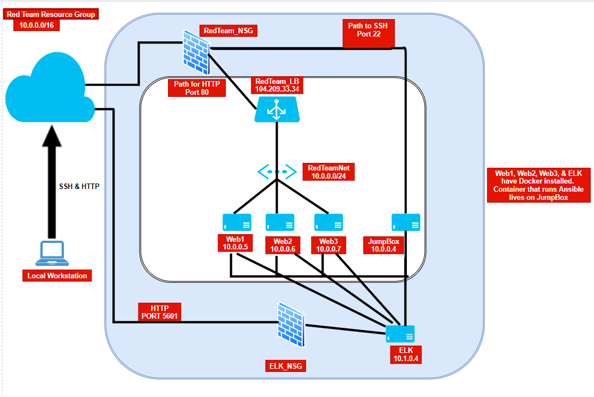

## Automated ELK Stack Deployment

The files in this repository were used to configure the network depicted below.

This document contains the following details:
- Description of the Topology 
- Access Policies
- ELK Configuration
-Beats in Use Including the following:
-Machines Being Monitored
- How to Use the Ansible Build

These files have been tested and used to generate a live ELK deployment on Azure. They can be used to either recreate the entire deployment pictured above. Alternatively, select portions of the Filebeat-Playbook.yml file may be used to install only certain pieces of it, such as Filebeat. Following is an example of teh filebeat-playbook.yml used within the ELK Stack Deployment.

  -Filebeat-Playbook.yml

### Description of the Topology

The main purpose of this network is to expose a load-balanced and monitored instance of DVWA, the D*mn Vulnerable Web Application.

Load balancing is the process of distributing network traffic across multiple servers. This ensures the availability of resources such as applications and websites.The technology of load balancing assist in maintaining good end-user experiences.
Load balancing works to ensure that the application will be highly available, in addition to restricting inbound access to the network. In this case, the resources being "balanced" are specifically called out as Web1, Web2, and Web3. 
Load balancing ensures that no single server bears too much demand and spreads the incoming traffic evenly. Load balancers play a key part in addressing the availability portion of the CIA Triad (Confidentiality, Integrity, Availability). 

The network presented here also includes a Jump Box which is advantages for the follwoing reasons: 
1. The Jump Box prevents additional VM's from being exposed to the public. 
2. The Jump Box is the only VM in the environment that connects two networks (RedTeamNet and ELK_NET) 
3. The Jump Box is the only point of entry to the web servers; allowing for only one open port (SSH port 22). 

Integrating the ELK server allows users to easily monitor the vulnerable VMs for changes to their respective file systems as well as allowing the administrator to obtain system metrics, such as CPU usage. 
- _TODO: What does Filebeat watch for?_
- _TODO: What does Metricbeat record?_

| Name     | Function | IP Address | Operating System |
|----------|----------|------------|------------------|
| Jump Box | Gateway  | 10.0.0.4   | Linux            |
| DVWA1	   | WebServer| 10.0.0.5   | Linux            |
| DVWA2    | WebServer| 10.0.0.6   | Linux            |
| DVWA3    | WebServer| 10.0.0.7   | Linux            |

### Access Policies

The machines on the internal network are not exposed to the public Internet. 

Only the _____ machine can accept connections from the Internet. Access to this machine is only allowed from the following IP addresses:
- _TODO: Add whitelisted IP addresses_

Machines within the network can only be accessed by _____.
- _TODO: Which machine did you allow to access your ELK VM? What was its IP address?_

A summary of the access policies in place can be found in the table below.

| Name     | Publicly Accessible | Allowed IP Addresses |
|----------|---------------------|----------------------|
| Jump Box | Yes/No              | 10.0.0.1 10.0.0.2    |
|          |                     |                      |
|          |                     |                      |

### Elk Configuration

Ansible was used to automate configuration of the ELK machine. No configuration was performed manually, which is advantageous because...
- _TODO: What is the main advantage of automating configuration with Ansible?_

The playbook implements the following tasks:
- _TODO: In 3-5 bullets, explain the steps of the ELK installation play. E.g., install Docker; download image; etc._
- ...
- ...

The following screenshot displays the result of running `docker ps` after successfully configuring the ELK instance.

### Target Machines & Beats
This ELK server is configured to monitor the following machines:
- _TODO: List the IP addresses of the machines you are monitoring_

We have installed the following Beats on these machines:
- _TODO: Specify which Beats you successfully installed_

These Beats allow us to collect the following information from each machine:
- _TODO: In 1-2 sentences, explain what kind of data each beat collects, and provide 1 example of what you expect to see. E.g., `Winlogbeat` collects Windows logs, which we use to track user logon events, etc._

### Using the Playbook
In order to use the playbook, you will need to have an Ansible control node already configured. Assuming you have such a control node provisioned: 

SSH into the control node and follow the steps below:
- Copy the _____ file to _____.
- Update the _____ file to include...
- Run the playbook, and navigate to ____ to check that the installation worked as expected.

_TODO: Answer the following questions to fill in the blanks:_
- _Which file is the playbook? Where do you copy it?_
- _Which file do you update to make Ansible run the playbook on a specific machine? How do I specify which machine to install the ELK server on versus which to install Filebeat on?_
- _Which URL do you navigate to in order to check that the ELK server is running?

_As a **Bonus**, provide the specific commands the user will need to run to download the playbook, update the files, etc._
